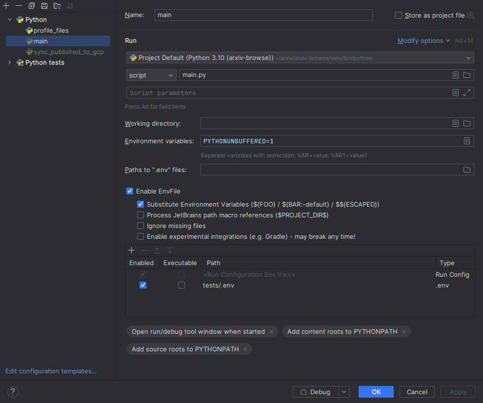
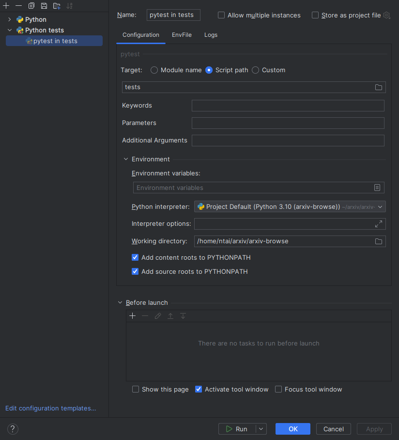

# arxiv-browse

Flask app for /abs and /list pages.

## Running Browse for development

You can run the browse app with minimal test data from this repo:


    python --version
    # 3.11.x
    python -m venv ./venv
    source ./venv/bin/activate
    pip install poetry==1.3.2
    poetry install

    python main.py
    google-chrome http://127.0.0.1:8080/abs/0906.5132

This will monitor for any changes to the Python code and templates and restart the server.

This method will only give you access to minimal data in the directories in
`tests/data/abs_files` and `tests/data/cache` when looking for the document
metadata and PDF files. Listings don't work in this mode. These paths can be
overridden via environment variables, see `browse/config.py`.

## Test suite


    pytest tests

The above method will only give you access to minimal data in the built-in test
dataset. For full (read-only) access to the production database, the following
steps are necessary:

Prerequisites:
you are logged into gcloud and have default application credentials. This
can be achieved by calling `gcloud auth login --update-adc --force` and
logging into your @arxiv.org account.

Set these two port variable in the environment (two unused and different ports):
    
    export MAIN_DB_PORT=3301
    export LATEXML_DB_PORT=3302

### Step 2 Create a .env file

Create the '.env' file somewhere. Using tests/.env is suggested.

``` bash
MAIN_DB_PORT=3301
LATEXML_DB_PORT=3302

# The value of `CLASSIC_DB_URI` one can obtain by

MAIN_SECRET=$(gcloud secrets versions access latest --project=arxiv-production  --secret=readonly-arxiv-db-uri)
CLASSIC_DB_URI=$(echo $MAIN_SECRET | sed -e "s#/arXiv.*#127.0.0.1:${MAIN_DB_PORT}/arXiv#")

# The value of `LATEXML_DB_URI` one can obtain by
LATEXML_SECRET=$(gcloud secrets versions access latest --project=arxiv-production  --secret=latexml_db_uri_psycopg2)
LATEXML_DB_URI=$(echo $LATEXML_SECRET | sed -e "s#/latexmldb.*#127.0.0.1:${LATEXML_DB_PORT}/latexmldb#")

cat >> tests/.env << EOF
ENV_CREATED="$(date)"
DOCUMENT_ABSTRACT_SERVICE=browse.services.documents.db_docs
ABS_PATH_ROOT=gs://arxiv-production-data
DOCUMENT_CACHE_PATH=gs://arxiv-production-data/ps_cache
DOCUMENT_LISTING_PATH=gs://arxiv-production-data/ftp
DISSEMINATION_STORAGE_PREFIX=gs://arxiv-production-data
LATEXML_ENABLED=True
LATEXML_BUCKET="gs://latexml_document_conversions"
LATEXML_BASE_URL=//127.0.0.1:8080
FLASKS3_ACTIVE=1
CLASSIC_DB_URI=$CLASSIC_DB_URI
LATEXML_DB_URI=$LATEXML_DB_URI
EOF

```

### Step 3 pycharm (optional)

If you have a PyCharm,
script: main.py
Enable env files
   Add tests/.env



### Step 4 Running cloud-sql-proxy

This step runs a DB connection proxy to allow easy secure connection from the dev evn to 
a DB at GCP. Keep the cloud-sql-proxy command running while you are working.

You can obtain the database name `MAIN_DB_NAME` and `LATEXML_DB_NAME` from the
same `$SECRET` as in the previous steps:
    
    MAIN_DB_NAME=$(echo $MAIN_SECRET | sed -e "s#^.*unix_socket=/cloudsql/##")
    LATEXML_DB_NAME=$(echo $LATEXML_SECRET | sed -e "s#^.*host=/cloudsql/##")

    cloud-sql-proxy --address 0.0.0.0 --port ${MAIN_DB_PORT} ${MAIN_DB_NAME}
    cloud-sql-proxy --address 0.0.0.0 --port ${LATEXML_DB_PORT} ${LATEXML_DB_NAME}

To check if the proxy is working, you can use mysql client to connect to the db.

    bash
    mysql -u browse -p --host 127.0.0.1 --port ${MAIN_DB_PORT} arXiv
    Enter password: 
    ...
    Type 'help;' or '\h' for help. Type '\c' to clear the current input statement.
    
    mysql> show tables;
    +------------------------------------------+
    | Tables_in_arXiv                          |
    +------------------------------------------+
    | Subscription_UniversalInstitution        |


### Step 5 Run the browse flask server

Run

    python main.py
    # this is a paper that is not in the test data 
    # if you get NOT FOUND, then it is not yet configured to use a GCP DB
    google-chrome http://127.0.0.1:8080/abs/2102.08245v1

## Configuration Parameters

See `browse/config.py` for configuration parameters and defaults). Any of these
can be overridden with environment variables.

## Tests and linting for PRs

There is a github action that runs on PRs that merge to develop. PRs for which
these tests fail will be blocked. It is the equivalent of running:

    ```
    # if there are Python syntax errors or undefined names
    ruff check browse
    pytest tests
    ```

## Setting up pytest in PyCharm




### Makefile

There is a make file form running the app and other tasks.

```bash
make venv
````
